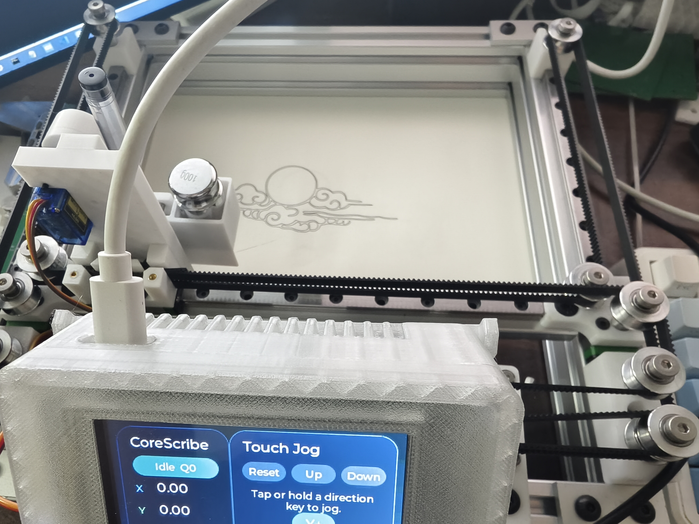
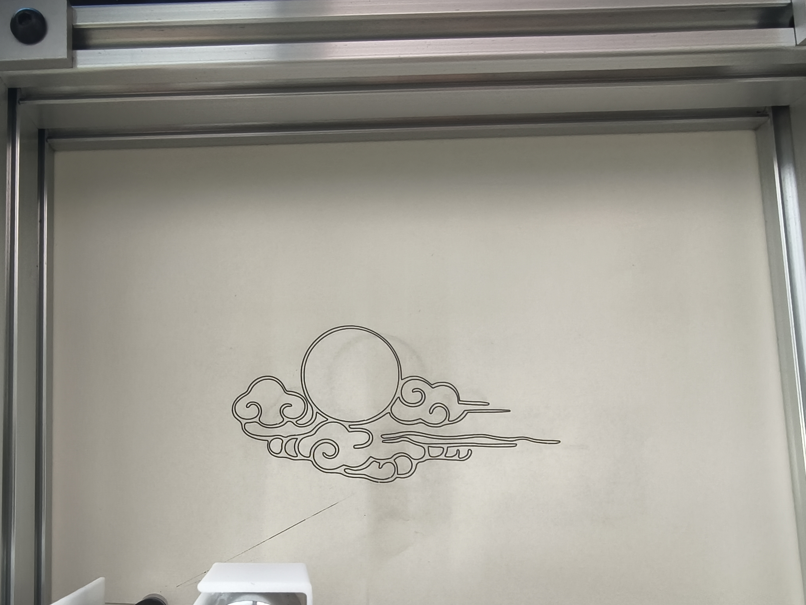

# CoreScribe

基于 STM32 + FreeRTOS + LVGL 开发的 CoreXY 结构绘图仪（写字机）项目，覆盖从硬件设计、底层驱动到运动控制的全流程嵌入式开发实战，配套详细的技术博客讲解。



[](https://opensource.org/licenses/MIT)

👉 项目配套详解博客：([STM32 绘图仪 文章汇总 – xuuuu404](https://www.xuuuu404.com/stm32-绘图仪/))

## 📋 项目概述

CoreScribe 是面向嵌入式开发者的开源 CoreXY 绘图仪项目，以「软硬件全链路开发」为核心目标，完整实现：

- 硬件层：CoreXY 机械结构、STM32 最小系统、步进电机驱动、外设接口设计

- 软件层：FreeRTOS 任务调度、LVGL 图形界面移植、Grbl 指令解析

- 应用层：串口通信、触摸屏交互、绘图精度校准、异常处理

项目适合 STM32 进阶学习、嵌入式软硬结合开发、运动控制类项目参考。

## 🛠️ 开发环境

### 硬件清单

|组件|推荐型号/规格|备注|
|---|---|---|
|主控芯片|STM32F407VET6|可替换为其他F4型号|
|电机驱动|TMC2209 步进电机驱动模块|需支持16细分|
|机械结构|CoreXY 运动结构（2路步进电机）||
|外设|电阻触摸屏（3.2寸）|适配LVGL显示|
|供电|12V 2A DC 电源|保障电机驱动供电稳定|
### 软件环境

- 开发工具：STM32CubeIDE 1.19.0+（推荐）、STM32CubeMX 6.9.0

- 系统内核：FreeRTOS V10.4.3（静态/动态任务配置）

- 图形库：LVGL V8.3（已适配硬件屏驱动）

- 编译器：ARM GCC（CubeIDE内置）

- 调试工具：ST-Link V2、串口调试助手

- 机械设计：SolidWorks 2023及以上版本

## 🧩 硬件设计（PCB & 机械结构）

### 📦 PCB 设计（嘉立创开源）

 👉 **在线查看/下单**：[CoreScribe STM32F407 主控板]([STM32写字机 - 立创开源硬件平台](https://oshwhub.com/xuuuu404/stm32-writing-machine)) 

- 版本：V1.0 - 主控：STM32F407VET6 
- 接口：2 路步进电机驱动接口、LCD/Touch 接口、串口、EEPROM 存储
- 包含：原理图、BOM 表、Gerber 文件


###  🧰 机械结构（SolidWorks）

项目已上传完整 CoreXY 写字机装配体、零件文件。

#### 文件路径

```Plain Text
CAD/
├── Parts/          # 零件源文件 (*.sldprt)
├── Assemblies/     # 整机装配体 (*.sldasm)

```

#### 使用说明

- **设计软件**：SolidWorks 2023+，低版本可能存在兼容问题

- **打开方式**：直接双击 `CAD/Assemblies/` 下的整机装配体文件，无需额外关联零件（已打包完整）

  

## 🚀 快速上手

### 1. 代码获取

克隆仓库并进入项目目录：

```Plain Text
git clone https://github.com/Hui404/CoreScribe.git
cd CoreScribe

```

### 2. 硬件搭建

参考博客「绘图仪开发 - PCB设计/硬件调试」章节完成：

1. CoreXY 机械结构组装，确认同步带张力；

2. STM32 最小系统与电机驱动模块接线；

3. 外设连接：触摸屏（FSMC接口）、串口（USART1）、电源接口；

4. 硬件自检：通电后检查电机、屏幕是否正常。

### 3. 代码编译与下载

1. 打开 STM32CubeIDE，通过 Import 导入本项目，或打开 `CoreScribe.ioc` 生成CubeIDE工程；

2. 根据实际硬件接线，在CubeIDE中修改引脚配置、时钟树参数；

3. 修改 `cpu_map.h` 中的电机引脚、串口波特率、细分系数等参数；

4. CubeIDE一键编译代码，通过 ST-Link 下载并在线调试程序。

### 4. 功能测试

|测试项|测试方法|
|---|---|
|电机运动|串口发送 `G0 X10 Y10` 指令，验证X/Y轴运动方向与步距精度|
|LVGL界面|触摸屏操作「点位控制」，确认界面响应与显示正常|
|绘图测试|导入 Docs/示例GCode.gcode，验证完整绘图流程|


## 📂 项目结构

```Plain Text
CoreScribe/
├── Core/                # 包含外设模块化驱动
├── Middlewares/         # 中间件（FreeRTOS源码、LVGL源码、Grbl解析）
├── LVGL/ 				 # LVGL 图形库源码与硬件屏适配
├── grbl/ 				 # Grbl 运动控制协议解析与 CoreXY 运动学解算
├── Docs/                # 文档（硬件原理图、接线图、示例GCode、调试日志）
├── CAD/                 # SolidWorks机械设计文件（装配体+零件+通用格式）
├── .cproject            # STM32CubeIDE工程配置文件
├── .project             # STM32CubeIDE工程配置文件
├── CoreScribe.ioc       # STM32CubeMX/CubeIDE配置文件
├── LICENSE              # MIT开源协议
└── README.md            # 项目说明

```

## 🔑 核心功能模块

|模块|核心实现|
|---|---|
|FreeRTOS任务管理|运动控制/串口通信/LVGL刷新/异常处理任务划分，优先级配置|
|Grbl指令解析|适配Grbl核心指令集，支持GCode解析|
|LVGL人机交互|硬件屏驱动移植、界面布局设计、触摸屏事件响应|
## 🐞 常见问题与解决方案

|问题现象|排查方向|
|---|---|
|电机无响应|1. 驱动模块供电/接线；2. FreeRTOS任务栈大小；3. 引脚定义错误|
|LVGL界面花屏|1. 屏驱动时序配置；2. LVGL刷新频率；3. 显存分配大小|
|绘图精度偏差|1. CoreXY机械参数校准；2. 步进电机细分设置；3. 同步带较松|
|串口通信异常|1. 波特率/奇偶校验配置；2. 串口中断优先级；3. 数据缓存溢出|
|SolidWorks装配体打不开|1. SW版本过低；2. 未拉取完整CAD文件；3. 零件路径缺失|
## 📄 开源协议

本项目基于 **MIT License** 开源（详见 LICENSE 文件），你可以：

- ✅ 自由使用、修改、复制本项目代码/硬件设计/机械图纸

- ✅ 将修改后的代码用于商业产品

- ✅ 分发本项目的源代码或二进制文件

- ❗ 必须保留版权声明和协议文本，作者无需承担任何使用风险

## ✨ 贡献与致谢

- 欢迎提交 Issue 反馈问题，或通过 PR 提交代码优化建议；

- 感谢 Grbl 开源项目提供的运动控制协议参考；

- 感谢 LVGL/FreeRTOS 官方提供的开源库与技术文档；

- 感谢嵌入式开源社区的技术分享与问题解答。